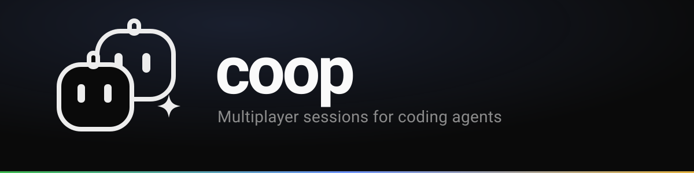

<p align="center">Multiplayer sessions for coding agents.</p>

<p align="center">
  <a href="documentation/overview.md">Overview</a> ·
  <a href="documentation/architecture.md">Architecture</a> ·
  <a href="documentation/deployment.md">Deployment</a> ·
  <a href="documentation/contributing.md">Contributing</a>
</p>

<br />

One person runs a coding agent. Everyone else gets a read-only transcript they
can't touch. coop turns that into a room the whole team can enter — watch the
agent work live, drop it a message mid-task, or take over and drive.

It works with Claude Code, opencode, and pi. `coop attach` spots which one
you're running and wires it up; anything else falls back to wrapping the
terminal. Nothing is scraped off the screen — coop listens through each tool's
own hook system, and steering goes back the same way.

<br />

## Documentation

- [Overview](documentation/overview.md) — what coop is and how it works
- [Architecture](documentation/architecture.md) — the pieces and how they fit together
- [Deployment](documentation/deployment.md) — self-hosting, two ways
- [Contributing](documentation/contributing.md) — local setup and conventions

## Quick start

You'll need [Bun](https://bun.sh), [Go](https://go.dev), a Postgres database,
and a GitHub OAuth app. Copy `apps/web/.env.example` to `apps/web/.env.local`
and fill it in.

```bash
bun install
bun run dev            # relay + web viewer on http://localhost:3000
```

In another terminal, build the CLI and point it at a project of yours:

```bash
cd packages/cli && go build -o coop ./cmd/coop

cd ~/your-project
~/path/to/coop attach   # then start claude, opencode, or pi as usual
```

Open `http://localhost:3000`, open your session, and share the link.

<br />

<p align="center">Built with Go, Next.js, and Postgres — by <a href="https://francogalfre.site">Franco Galfré</a>.</p>
